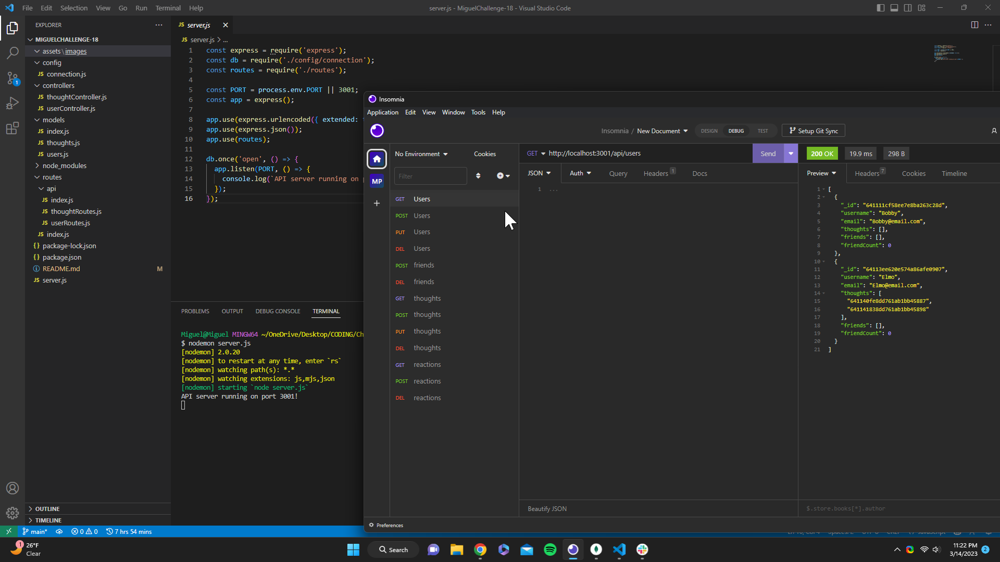

# Miggys Social Network API

## Description 
- This application was created to allow users to add, update, delete and see all of the information that has been stored in a database. It allows users to see their current friends, thoughts and reactions using  GET route, adding using a POST route, updating information using a PUT route and deleting info using a DELETE route. Insomnia is required

## Table of contents
- [Description](#description)
- [Installation](#installation)
- [Usage](#usage)
- [Credits](#credits)
- [License](#license)
- [Badges](#badges)

## Installation 
- in order to install this prodcut you will be needing the following dependencies: run npm i and node server.js after that you can use either mongoDB compass or insomnia.

## Usage
- This can be utilized alongside Insomnia which will be necessary after you have connected to a PORT

- <a href="https://github.com/Darkunitx/Miggys-Social-Network">Github Repo</a>
- <a href="">Demo Video</a>

## Credits 

- In collaboration with : 
- Miguel Montenegro  https://github.com/Darkunitx
- Nicholas Mamberger https://github.com/NickHM05
- Yassin Abasher https://github.com/Abasheryassin
- Insctructor Charlie Werness
- TA Emma Olson
- Bootcamp NoSQL Mini Project
- https://day.js.org/docs/en/display/format

## License

- MIT License

- Copyright (c) [2023] [Miggys Social Network API]

- Permission is hereby granted, free of charge, to any person obtaining a copy of this software and associated documentation files (the "Software"), to deal in the Software without restriction, including without limitation the rights to use, copy, modify, merge, publish, distribute, sublicense, and/or sell copies of the Software, and to permit persons to whom the Software is furnished to do so, subject to the following conditions:

- The above copyright notice and this permission notice shall be included in all copies or substantial portions of the Software.

- THE SOFTWARE IS PROVIDED "AS IS", WITHOUT WARRANTY OF ANY KIND, EXPRESS OR IMPLIED, INCLUDING BUT NOT LIMITED TO THE WARRANTIES OF MERCHANTABILITY, FITNESS FOR A PARTICULAR PURPOSE AND NONINFRINGEMENT. IN NO EVENT SHALL THE AUTHORS OR COPYRIGHT HOLDERS BE LIABLE FOR ANY CLAIM, DAMAGES OR OTHER LIABILITY, WHETHER IN AN ACTION OF CONTRACT, TORT OR OTHERWISE, ARISING FROM, OUT OF OR IN CONNECTION WITH THE SOFTWARE OR THE USE OR OTHER DEALINGS IN THE SOFTWARE.

## Badges

